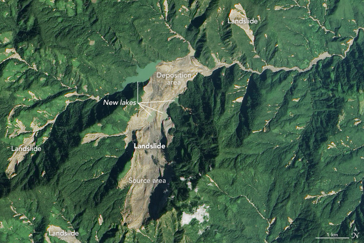

[![Forks][forks-shield]][forks-url]
[![Stargazers][stars-shield]][stars-url]
[![Issues][issues-shield]][issues-url]
<!-- [![LinkedIn][linkedin-shield]][linkedin-url] -->


<!-- PROJECT LOGO -->
<br />
<p align="center">
  <a href="https://github.com/shulavkarki/LandslidePrediction-from-satellite-imagery/">
    
  </a>

  <h3 align="center">Landslide Prediction From Satellite Imagery</h3>

  <p align="center">
    Using Attention Boosted Distant Domain Transfer Learning
    <br />
    <a href="https://github.com/shulavkarki/LandslidePrediction-from-satellite-imagery/"><strong>Docs »</strong></a>
    <br />
    <br />
    <a href="https://github.com/shulavkarki/LandslidePrediction-from-satellite-imagery">View Demo</a>
    ·
    <a href="https://github.com/shulavkarki/LandslidePrediction-from-satellite-imagery/issues">Report Bug</a>
    ·
    <a href="https://github.com/shulavkarki/LandslidePrediction-from-satellite-imagery/issues">Request Feature</a>
    ·
    <a href="https://github.com/shulavkarki/LandslidePrediction-from-satellite-imagery/pulls">Send a Pull Request</a>
  </p>
</p>

<!-- ABOUT THE PROJECT -->
## About The Project

In this project, we carried out 3 experiments for the prediction of landslide in image.
Experiments were:
* Pre-trained Model used as fixed extractor and fine tuned with classifier. Different experiment was carried out with different model like ResNet18, Resnet50.
* Autoencoder was used to extract the representaion vector space and trained with out 1D convolution layers. [.....Ongoing]
* Attention was used along with autoencoder and classic CNN. [.......Ongoing]


### Built With

* [Python](https://python.com)
* [Pytorch](https://pytorch.com)
* [Tensorboard](https://www.tensorflow.org/tensorboard)
<!-- * [Laravel](https://laravel.com) -->


<!-- GETTING STARTED -->
## Getting Started


<!-- ### Prerequisites

This is an example of how to list things you need to use the software and how to install them.
* npm
```sh
npm install npm@latest -g
```

### Installation

1. Get a free API Key at [https://example.com](https://example.com)
2. Clone the repo
```sh
git clone https://github.com/your_username_/Project-Name.git
```
3. Install NPM packages
```sh
npm install
```
4. Enter your API in `config.js`
```JS
const API_KEY = 'ENTER YOUR API';
```


<!-- USAGE EXAMPLES -->
## Usage

Use this space to show useful examples of how a project can be used. Additional screenshots, code examples and demos work well in this space. You may also link to more resources.

_For more examples, please refer to the [Documentation](https://example.com)_

 -->

<!-- ROADMAP -->
## 🚧 Roadmap

See the [open issues](https://github.com/shulavkarki/LandslidePrediction-from-satellite-imagery) for a list of proposed features (and known issues).


<!-- PULLREQUESTS -->
## 🔗 Pull Request

This repo is under active development. If you have any improvements / suggestions please file an [issue](https://github.com/shulavkarki/LandslidePrediction-from-satellite-imagery/issues) or send in a [Pull Request](https://github.com/shulavkarki/LandslidePrediction-from-satellite-imagery/pulls).


<!-- CONTACT -->
## 📫 Contact

Project Link: [Github](https://github.com/shulavkarki/LandslidePrediction-from-satellite-imagery)

## 👥👥 Team

Akshey Sigdel

Anuskha Gupta

Rabin Pandey

Shulav Karki

## 🔗 Project Link: [Github](https://github.com/shulavkarki/LandslidePrediction-from-satellite-imagery)


<!-- MARKDOWN LINKS & IMAGES -->
<!-- https://www.markdownguide.org/basic-syntax/#reference-style-links -->
[forks-shield]: https://img.shields.io/github/forks/roshanlam/ReadMeTemplate?style=for-the-badge
[forks-url]: https://github.com/shulavkarki/LandslidePrediction-from-satellite-imagery/members
[stars-shield]: https://img.shields.io/github/stars/roshanlam/ReadMeTemplate?style=for-the-badge
[stars-url]:https://github.com/shulavkarki/LandslidePrediction-from-satellite-imagery/stargazers
[issues-shield]: https://img.shields.io/github/issues/roshanlam/ReadMeTemplate?style=for-the-badge
[issues-url]: https://github.com/shulavkarki/LandslidePrediction-from-satellite-imagery/issues
<!-- [linkedin-shield]: https://img.shields.io/badge/-LinkedIn-black.svg?style=flat-square&logo=linkedin&colorB=555
[linkedin-url]: https://linkedin.com/ -->
